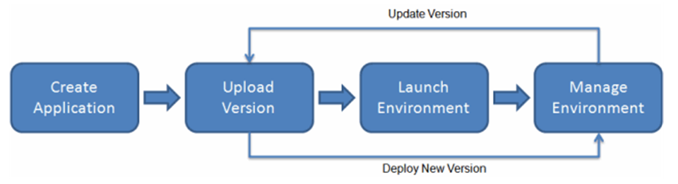
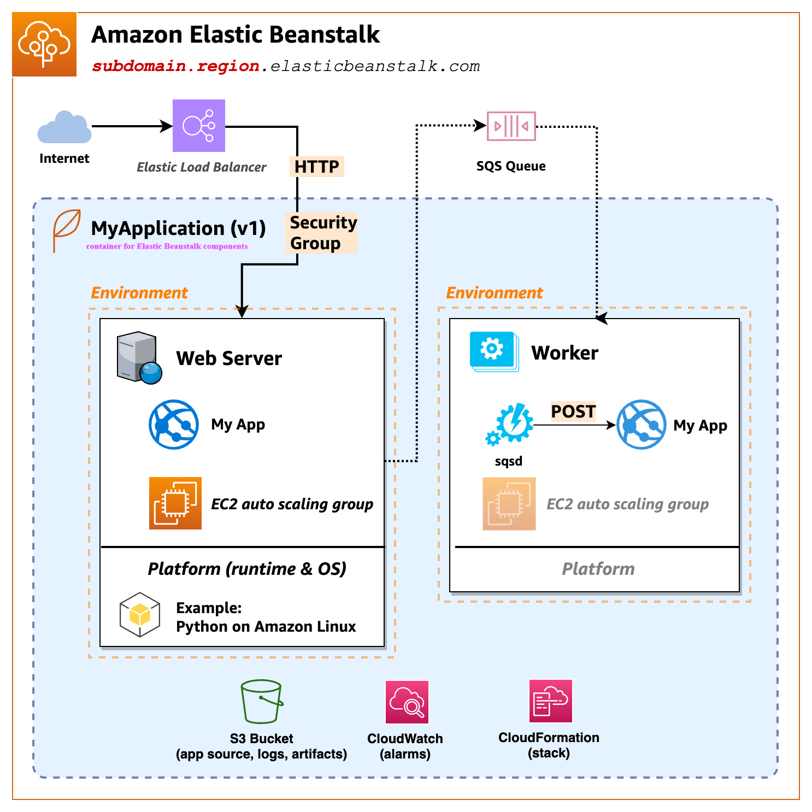
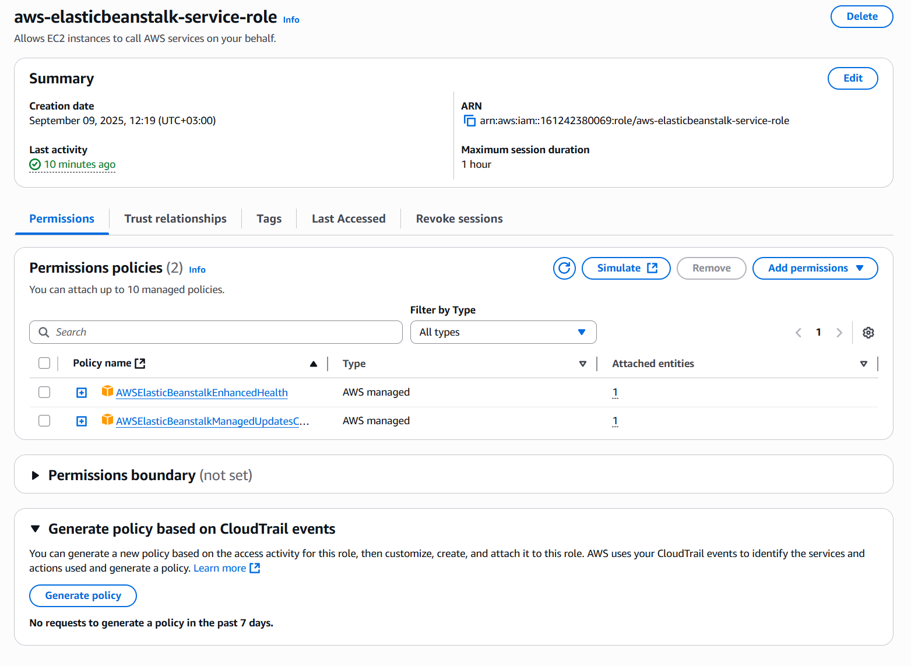
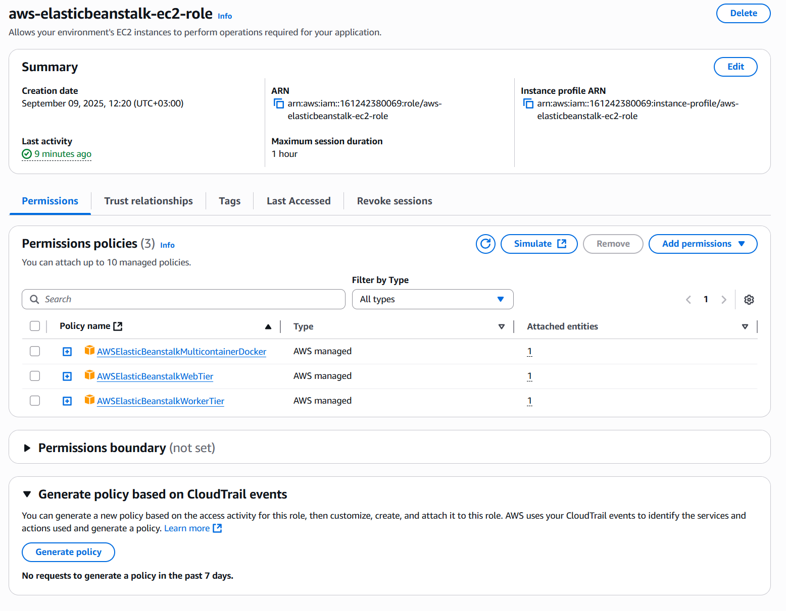
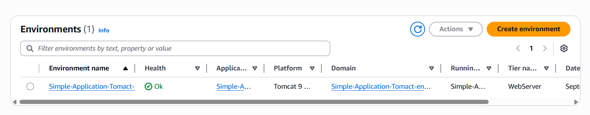
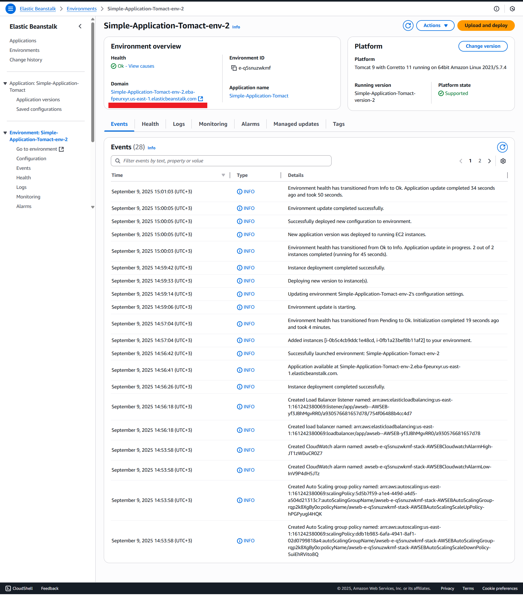
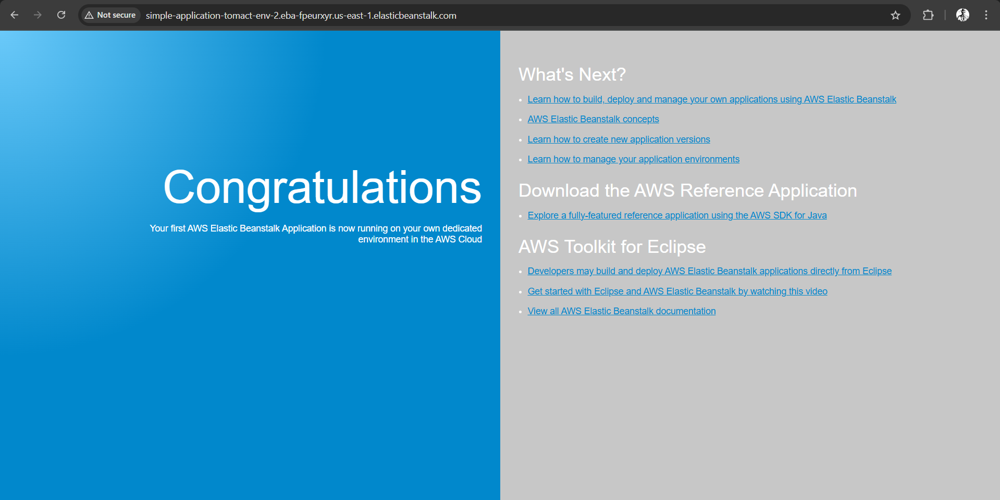

# 🚀 Elastic Beanstalk Guide

Welcome to your professional guide for deploying applications using **AWS Elastic Beanstalk**!  
Below you'll find an easy-to-follow workflow, complete with helpful notes, step-by-step instructions, and visual aids.  
Let's get started! 😎🌱

---

## 📊 Elastic Beanstalk Workflow Diagram

---

## 🏗️ Create an Elastic Beanstalk Environment

> **ℹ️ Note:**  
> If the status in the **Health** column is not `Ok`, the environment is still starting. Please wait until it changes to `Ok` before proceeding. ⏳

### 1. 🆕 Create Application

#### ⚙️ Configure Environment
- **Application name:** `Simple-Application-Tomact`
- **Domain:** *Skip*
- **Platform:**
  - Platform: **Tomcat**
  - Platform branch: **Tomcat 9 with Corretto 11** running on **64bit Amazon Linux 2023**
  - Platform version: **5.7.4 (Recommended)**

➡️ **Click "Next"**

---

#### 🔐 Configure Service Access

> **Service Role:**   
> Create and manage resources (such as EC2, ELB, Auto Scaling, CloudWatch Logs, etc.).  
> Monitor the status of your environment.

- **Service Role:** *Create Role (Elastic Beanstalk)*
  - Elastic Beanstalk - Environment  
    - `aws-elasticbeanstalk-service-role` → *Role Name*
      - `AWSElasticBeanstalkEnhancedHealth`
      - `AWSElasticBeanstalkManagedUpdatesCustomerRolePolicy`
    - 

> **EC2 Instance Profile:**  
> The instance itself can:  
> Download the application from S3  
> Upload logs to CloudWatch  
> Communicate with the Elastic Beanstalk service  

- **EC2 Instance Profile:** *Create Role (Elastic Beanstalk)*
  - Elastic Beanstalk - Compute  
    - `aws-elasticbeanstalk-ec2-role` → *Role Name*
      - `AWSElasticBeanstalkWebTier`
      - `AWSElasticBeanstalkWorkerTier`
    - 

- **EC2 Key Pair:** *Skip (optional)*

➡️ **Click "Next"**

---

#### 🖥️ Instance Settings
- **Public IP address:** *Enable*
- **Instance subnets:** *Choose 2 Subnets*
- **Database:** *Disable*

➡️ **Click "Next"**

---

#### 🌐 Configure Instance Traffic & Scaling *(Optional)*
- **EC2 Security Groups:** *Skip* (Default SGs will be created)
- **Auto Scaling Group:**
  - **Environment type:** Load Balanced
  - **Min instances:** 2
  - **Max instances:** 6
- **Instance Types:** `t3.micro`, `t3.small`

➡️ **Click "Next"**

---

#### 📈 Monitoring
- **CloudWatch Custom Metrics - Instance:** *Skip*
- **CloudWatch Custom Metrics - Environment:** *Skip*

#### 🔄 Managed Platform Updates
- **Managed Updates:** *Disable*

#### 🧩 Platform Software
- **Proxy Server:** `Nginx`

➡️ **Click "Next"**  
➡️ **Click "Create"**

---

---

> 🟢 When you **choose the URL**, a new browser tab opens.  
> If you see `HTTP Status 404 - Not Found` or the **Default Page of Elastic Beanstalk**,  
> This is expected! The application server doesn't have an application running yet. 🕸️

---

## 🚢 Deploy a Sample Application to Elastic Beanstalk

Back in the **Elastic Beanstalk Dashboard**, choose **Upload and Deploy**.

### Steps:

1. **Upload and Deploy**
    - Choose **File**, then navigate to and open the `tomcat.zip` file you downloaded.
    - Choose **Deploy**.

⏳ It will take a minute or two for Elastic Beanstalk to update your environment and deploy the application.

---

📋 **Copy the Domain of Elastic Beanstalk & paste it in your Browser!** 🌍

---

You can download **Tomcat Project** from [here](https://drive.google.com/file/d/1wxTffIF_ALpXk2IZErRDk57ALpBAzYNe/view?usp=sharing)

Happy deploying! 🎉  