# 🚀 Create Snapshot from EBS

This lab guides you through the process of creating an **Amazon EBS volume**, attaching it to an EC2 instance, applying a file system, and performing a **snapshot backup**.  
By the end of this lab, you will be able to:

- 🟢 **Create an Amazon EBS volume**
- 🔗 **Attach and mount your volume to an EC2 instance**
- 📸 **Create a snapshot of your volume**
- 🆕 **Create a new volume from your snapshot**
- 🖇️ **Attach and mount the new volume to your EC2 instance**

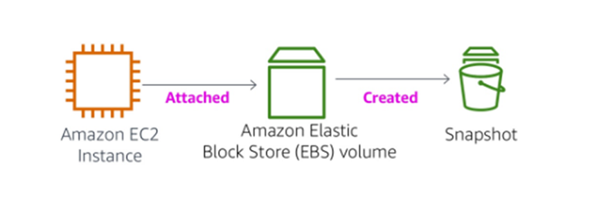

---

## 🖥️ EC2 Instance
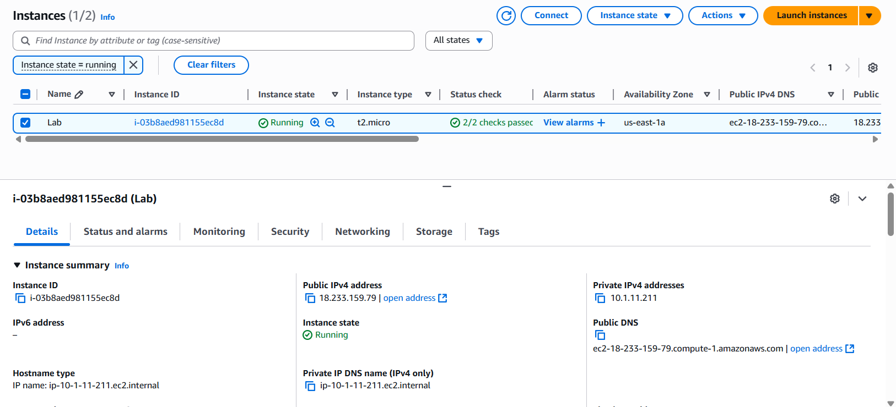

## 💽 Create EBS Volume
After **creating EBS Volume** attach it to **EC2 instance**  
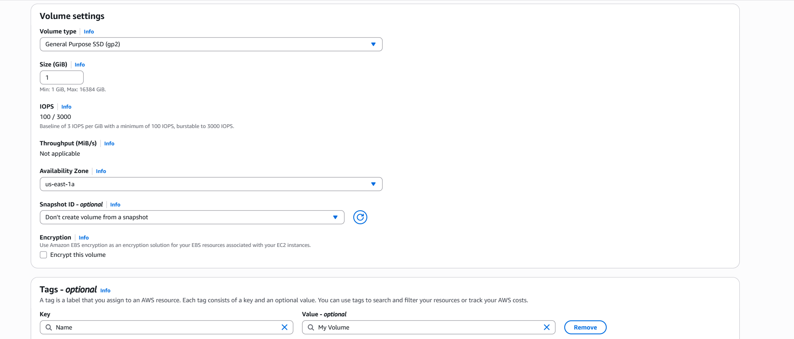

### 🔗 Attach Volume
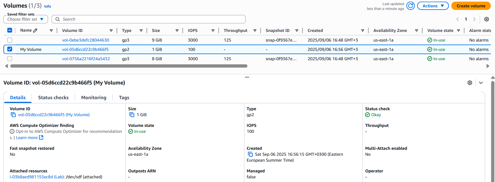

### 🗂️ Create and Configure Your File System
- After connecting to EC2
- To mount this volume whenever the instance is started, add a line to `/etc/fstab`

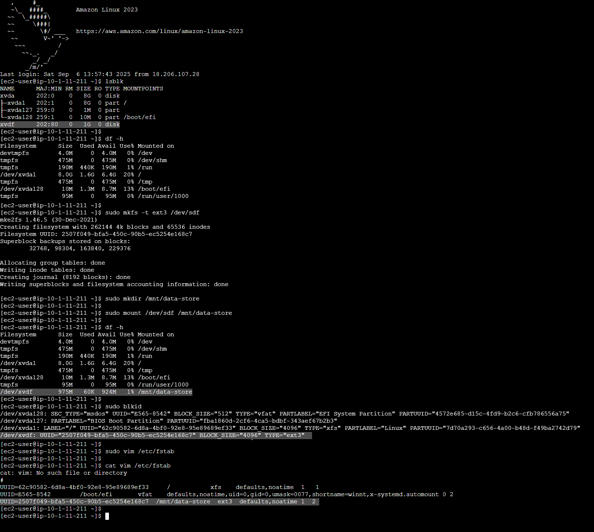

### 📄 Create File
Create a **file before taking a snapshot on the volume** to ensure that **you can retrieve the file after deleting it from this volume** once you create a **volume from snapshot**  
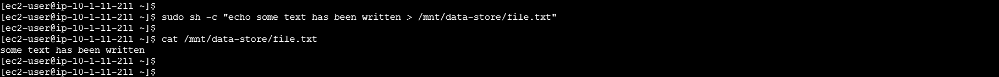

## 📸 Create an Amazon EBS Snapshot
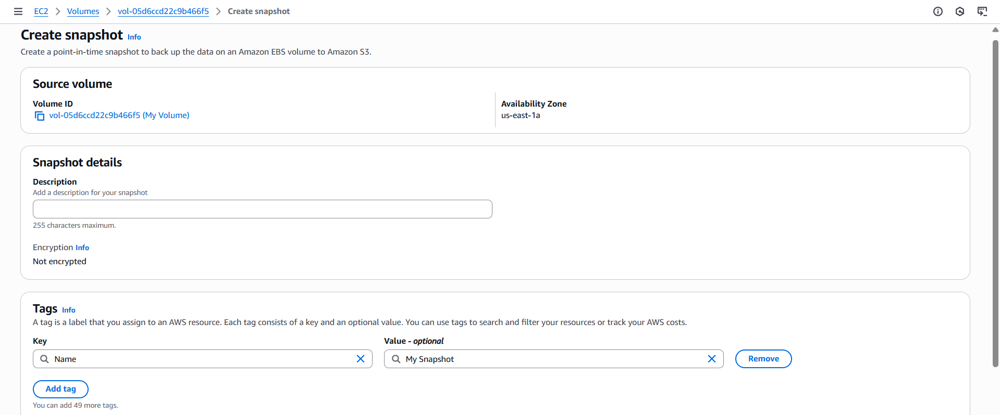
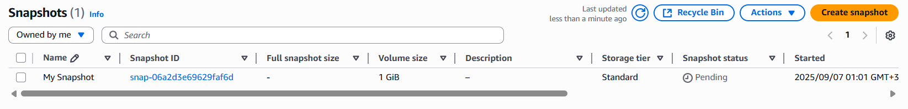

### 🗑️ Delete File
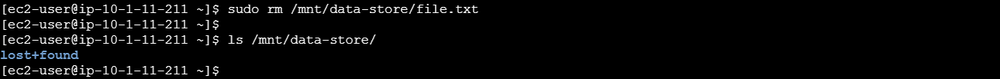

## ♻️ Restore the Amazon EBS Snapshot & Attach it
- Go to snapshot and **create volume from snapshot**
- After **restoring volume** attach it to EC2 instance  
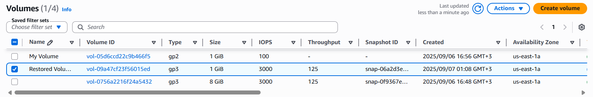
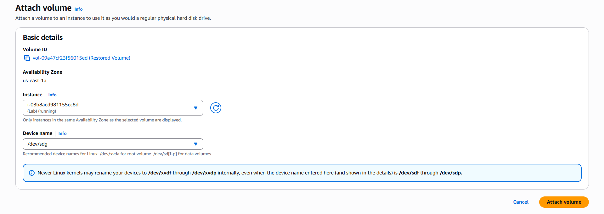

## 📂 Mount the Restored Volume
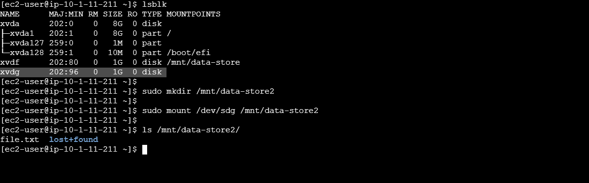

---

> ✨ **Tip:** Always test file recovery after restoring from a snapshot to ensure data integrity!