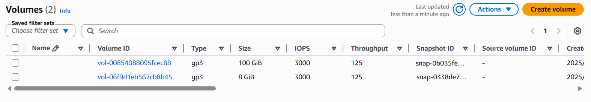

# 🚀 AWS EC2 & EBS Guide

Welcome to the AWS EC2 & EBS Professional Guide. This document provides an overview of EC2 instances, Elastic Block Store (EBS) volumes, and step-by-step procedures to add a new disk to your EC2 instance.

---

## 📑 Table of Contents

- [🚀 AWS EC2 \& EBS Guide](#-aws-ec2--ebs-guide)
  - [📑 Table of Contents](#-table-of-contents)
  - [📝 Overview](#-overview)
- [🏗️ Architecture](#️-architecture)
  - [🖥️ EC2 Instance](#️-ec2-instance)
  - [💾 EBS Volumes](#-ebs-volumes)
  - [🛠️ How to Add a New Disk](#️-how-to-add-a-new-disk)
  - [👍 Best Practices](#-best-practices)
  - [🔗 References](#-references)

---

## 📝 Overview

Amazon EC2 (Elastic Compute Cloud) provides scalable computing capacity in the AWS cloud, allowing users to run virtual servers as needed. Amazon EBS (Elastic Block Store) offers persistent block storage volumes for use with EC2 instances, supporting workloads that require durable and high-performance storage.

# 🏗️ Architecture

---

## 🖥️ EC2 Instance

An EC2 instance is a virtual server in Amazon's Elastic Compute Cloud (EC2) for running applications on the Amazon Web Services (AWS) infrastructure.

**Key Features:**
- ⚡ Scalable compute capacity
- 🧩 Variety of instance types for different workloads
- 🔐 Secure and resizable compute resources
- 🌐 Integration with AWS networking and security services

---

## 💾 EBS Volumes

Amazon EBS provides block-level storage volumes that can be attached to EC2 instances. These volumes persist independently from the life of an instance.

**Key Attributes:**
- 🗄️ Persistent storage
- 📸 Snapshots for backups and disaster recovery
- 🏎️ Multiple volume types optimized for performance and cost
- 🔒 Encryption and security features

---

## 🛠️ How to Add a New Disk

Adding a new disk (EBS volume) to your EC2 instance involves several steps, including volume creation, attachment, and configuration on the operating system.

**Step-by-Step Guide:**

1. **🆕 Create a New EBS Volume**
    - Go to the AWS Management Console.
    - Navigate to **Elastic Block Store > Volumes**.
    - Click **Create Volume**, specify the size and type, then create.

2. **🔗 Attach the Volume to Your EC2 Instance**
    - Select the newly created volume.
    - Click **Actions > Attach Volume**.
    - Select your EC2 instance and confirm.

3. **🔌 Connect to Your EC2 Instance**
    - Use SSH (for Linux) or Remote Desktop (for Windows) to connect.

4. **🗂️ Prepare and Mount the Disk on the Instance**
    - For **Linux**:
        - Use `lsblk` to list block devices.
        - Format the volume (e.g., `sudo mkfs.xfs  /dev/nvme1n1`).
        - Create a mount point (e.g., `sudo mkdir /testing`).
        - Mount the disk (e.g., `sudo mount /dev/nvme1n1 /testing`).
        - (Optional) Edit `/etc/fstab` to mount automatically on reboot.
    - For **Windows**:
        - Open Disk Management, initialize the new disk, create a new volume, and assign a drive letter.

---

## 👍 Best Practices

- 🛡️ **Backup Regularly:** Use EBS snapshots for regular backups.
- 📊 **Monitor Performance:** Use AWS CloudWatch to monitor disk and instance performance.
- 🔒 **Security:** Enable encryption for EBS volumes and ensure proper IAM permissions.
- 💰 **Optimize Costs:** Choose the appropriate volume type for your workload.

---

## 🔗 References

- [AWS EC2 Documentation](https://docs.aws.amazon.com/ec2/)
- [AWS EBS Documentation](https://docs.aws.amazon.com/ebs/)
- [EBS Volume Types](https://docs.aws.amazon.com/AWSEC2/latest/UserGuide/ebs-volume-types.html)
- [Attaching an Amazon EBS Volume to an Instance](https://docs.aws.amazon.com/AWSEC2/latest/UserGuide/ebs-attaching-volume.html)

---

*This guide is intended for system administrators and cloud engineers managing AWS infrastructure.*