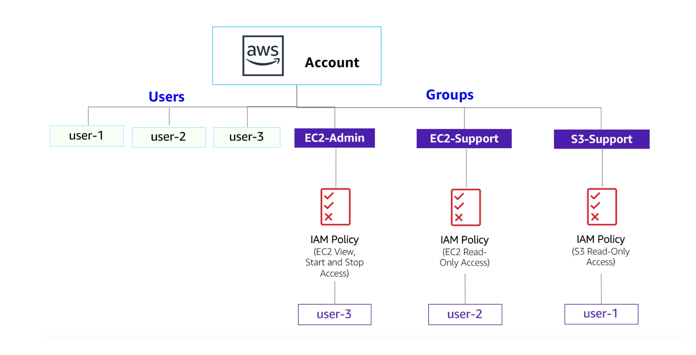
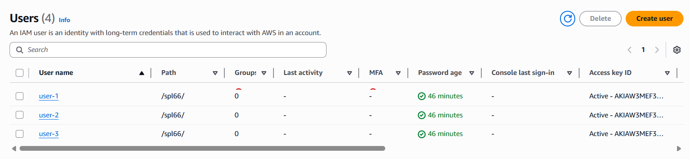
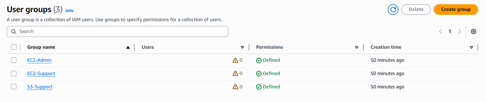
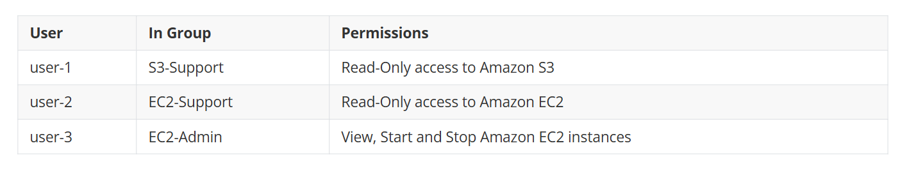
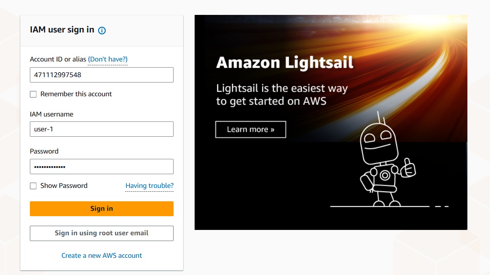
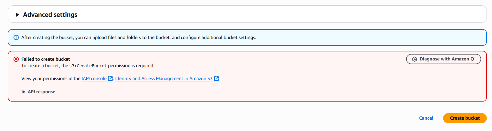
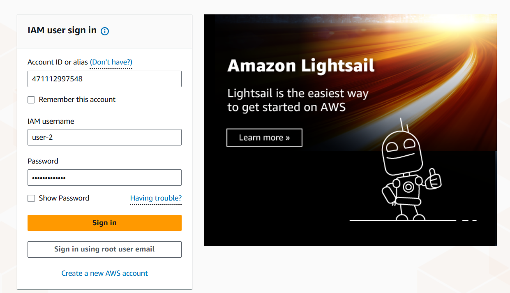
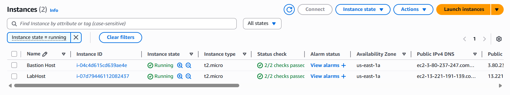
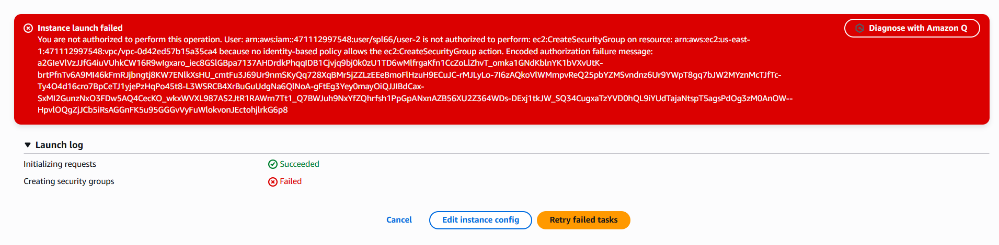
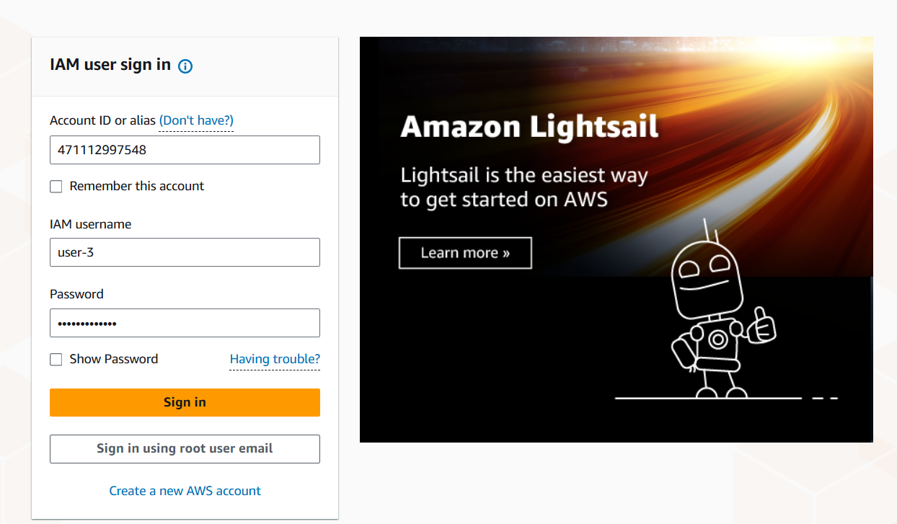

# 👤🔒 AWS IAM: Users, Groups & Permissions

Welcome! This guide demonstrates how to manage AWS IAM Users, Groups, and Permissions, with visual examples.

## 🧑‍💻 Users, 👥 Groups & 🛡️ Permissions

---

## 👤 Users
Create individual users for specific access needs.

---

## 👥 Groups
Organize users into groups for easier permission management.

---

## 🛡️ Permissions
- ➕ Add permissions to groups
- ➕ Add users to groups

---

## 👤 User1

- 🗂️ **Read-Only S3**
  - Can view S3 buckets.
  

- ❌ **Failed to Create S3**
  - Access denied for creating S3 buckets.
  

---

## 👤 User2

- 🗂️ **Read-Only EC2**
  - Can view EC2 instances.
  

- ❌ **Failed to Create EC2**
  - Access denied for creating EC2 instances.
  

---

## 👤 User3

- ▶️⏹️ **View, Start & Stop EC2**
  - Can view, start, and stop EC2 instances.
  
