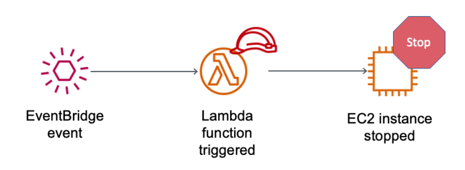
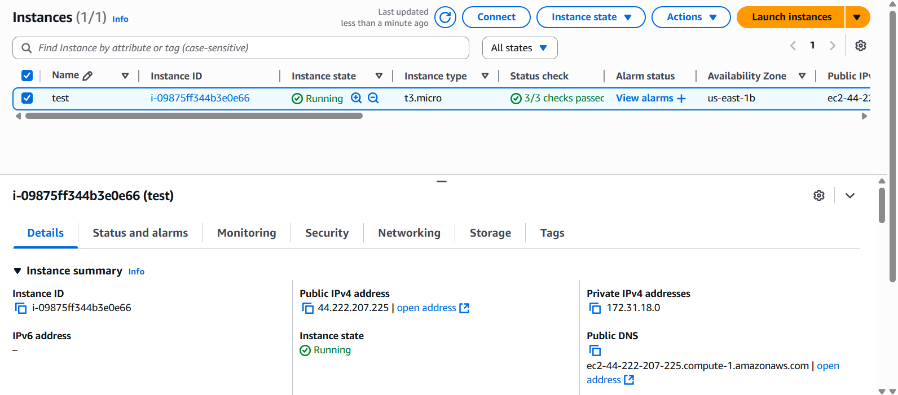
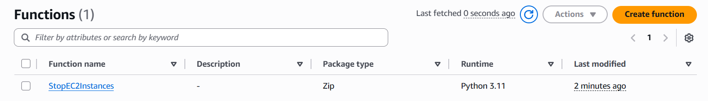
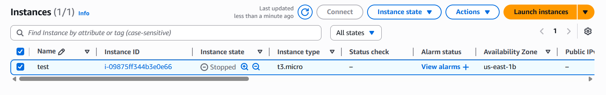

# 🚀 Create **AWS Lambda function** to **stop running EC2 instance** 🛑

Welcome to your **AWS Lambda function** lab! In this guide, you'll learn how to:

- 🛠️ Create an **AWS Lambda function**
- 📅 Create an **Amazon EventBridge event** to ***trigger the function every minute***
- 🔑 The **function** uses an AWS Identity and Access Management (***IAM***) role
- 🖥️ This **IAM role** allows the function to ***stop an Amazon Elastic Compute Cloud (Amazon EC2) instance*** that is **running**

---

## 🏗️ Architecture Overview

At the end of this lab, your architecture will look like this:



---

## 🟢 EC2 Running



---

## 📝 Create an IAM policy and role for your Lambda function

### 🛡️ Create Policy to Stop EC2

1. Go to Policy editor (JSON)
2. Click **Next**
3. Policy Name: `StopEC2`
4. Click **Create Policy**

```json
{
    "Version": "2012-10-17",
    "Statement": [
        {
            "Effect": "Allow",
            "Action": [
                "logs:CreateLogGroup",
                "logs:CreateLogStream",
                "logs:PutLogEvents"
            ],
            "Resource": "arn:aws:logs:*:*:*"
        },
        {
            "Effect": "Allow",
            "Action": [
                "ec2:Stop*"
            ],
            "Resource": "*"
        }
    ]
}
```

<br>

### 👤 Create Role for Lambda Function

1. Choose: **Lambda** → Next
2. Choose: **StopEC2** (Policy-Name)
3. Role Name: `StopEC2Role`
4. Click **Create Role**

---

## 🧑‍💻 Create AWS Lambda function

1. Click **Create Function**
    - Author from scratch
    - Function name: `StopEC2Instances`
    - Runtime: Python 3.11
    - Change default execution role: Use an existing role (`StopEC2Role`)
    - Click **Create Function**



---

## ⚡ Configure the trigger

From **Lambda Function**:

1. Add trigger
2. Select: **EventBridge (CloudWatch Events)**
3. Rule: Create a new rule
4. Rule name: `everyMinute`
5. Rule type: Schedule expression
6. Schedule expression: `rate(1 minute)`
7. Click **Add**

---

## 💻 Configure the Lambda function

Below the Function overview pane → choose **Code**

<br>

**Code source:**

```python
import boto3
region = '<REPLACE_WITH_REGION>'
instances = ['<REPLACE_WITH_INSTANCE_ID>']
ec2 = boto3.client('ec2', region_name=region)

def lambda_handler(event, context):
    ec2.stop_instances(InstanceIds=instances)
    print('stopped your instances: ' + str(instances))
```

Choose the **File menu** and **Save the changes**. Then, in the Code source box, **choose _Deploy_**.

---

## 🛑 EC2 instance Stopped



---

## 📚 Documentation Link

For further reference, see the official AWS Knowledge Center guide:  
👉 [Start or stop EC2 instances using Lambda and EventBridge](https://repost.aws/knowledge-center/start-stop-lambda-eventbridge)

---


✨ **Congratulations! You've automated EC2 instance stopping with AWS Lambda!** ✨

---