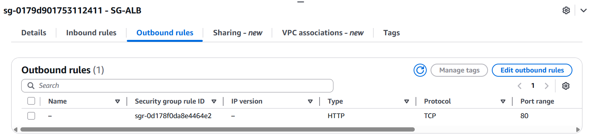
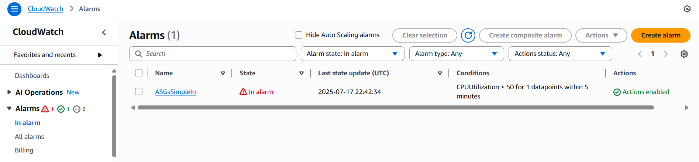

# AWS Auto Scaling Group (ASG) & Application Load Balancer (ALB) Architecture

This repository provides a comprehensive overview of a scalable and highly available architecture in AWS using Auto Scaling Groups (ASG) and Application Load Balancer (ALB). It covers key components such as Target Groups, Launch Templates, Security Groups, Scaling Policies, CloudWatch monitoring, and the deployment process.

---

## Table of Contents
- [AWS Auto Scaling Group (ASG) \& Application Load Balancer (ALB) Architecture](#aws-auto-scaling-group-asg--application-load-balancer-alb-architecture)
  - [Table of Contents](#table-of-contents)
  - [Architecture Overview](#architecture-overview)
  - [Target Group](#target-group)
  - [Application Load Balancer (ALB)](#application-load-balancer-alb)
    - [Security Group for ALB](#security-group-for-alb)
      - [Inbound Rules](#inbound-rules)
      - [Outbound Rules](#outbound-rules)
  - [Launch Template (LT)](#launch-template-lt)
    - [Security Group for Launch Template](#security-group-for-launch-template)
      - [Inbound Rules](#inbound-rules-1)
      - [Outbound Rules](#outbound-rules-1)
  - [Auto Scaling Groups (ASGs)](#auto-scaling-groups-asgs)
    - [Automatic Scaling Policies](#automatic-scaling-policies)
  - [Instances](#instances)
  - [Monitoring with CloudWatch](#monitoring-with-cloudwatch)
    - [CloudWatch Alerts: Instance Scale-In](#cloudwatch-alerts-instance-scale-in)
  - [Deployment Output](#deployment-output)
  - [Getting Started](#getting-started)

---

## Architecture Overview

The architecture leverages AWS components to ensure reliability, scalability, and security for web applications.


---

## Target Group

Target Groups route traffic to healthy EC2 instances registered behind the ALB.


---

## Application Load Balancer (ALB)

The ALB distributes incoming application traffic across multiple targets in one or more Availability Zones.


### Security Group for ALB

#### Inbound Rules

Defines allowed inbound traffic to the ALB.


#### Outbound Rules

Defines allowed outbound traffic from the ALB to the Security Group of the launch instance for enhanced security.



---

## Launch Template (LT)

Launch Templates define the configuration of EC2 instances in the ASG.


### Security Group for Launch Template

#### Inbound Rules

Specifies allowed inbound traffic to EC2 instances launched by the ASG. Only receives traffic from the ALB for improved protection.


#### Outbound Rules

Specifies allowed outbound traffic from EC2 instances.


---

## Auto Scaling Groups (ASGs)

Auto Scaling Groups ensure that the correct number of EC2 instances are running to handle the application load.

```bash
# Health Check Options: ELB, EC2 Instance

# Number of Instances
Desired: 2
Minimum: 1
Maximum: 4
```


### Automatic Scaling Policies

Set up scaling policies to automatically adjust the number of instances based on load.

```bash
# Scaling Policies:
- Simple Scaling Out
- Simple Scaling In
```


---

## Instances

Displays EC2 instances launched by the Auto Scaling Groups.

```bash
# Instances after launching Auto Scaling Groups
```


---

## Monitoring with CloudWatch

Monitor instance health and CPU utilization using CloudWatch. Scaling actions are triggered based on the CPU usage.

```bash
# CloudWatch monitors CPU Utilization:
# Scale Out: CPU Utilization > 50% (Add instance)
# Scale In:  CPU Utilization < 50% (Remove instance)
```


### CloudWatch Alerts: Instance Scale-In

```bash
# When CPU Utilization < 50%, an instance is removed
```



---

## Deployment Output

Summary of the deployment process and architecture output.


---

## Getting Started

To implement this architecture:

1. **Provision ALB and Target Groups:**  
   Set up Application Load Balancer and Target Groups.

2. **Configure Security Groups:**  
   Define inbound and outbound rules for ALB and EC2 instances.

3. **Create Launch Template:**  
   Specify instance configuration and attach security groups.

4. **Set up Auto Scaling Group:**  
   Attach Launch Template, set desired/min/max capacity, and configure health checks.

5. **Define Scaling Policies:**  
   Set up policies for scaling out and scaling in based on CloudWatch metrics.

6. **Monitor with CloudWatch:**  
   Track CPU Utilization and automate scaling actions.

---

**Author:**  
Ahmed Abd Elhamid ([Ahmed-1399](https://github.com/Ahmed-1399))