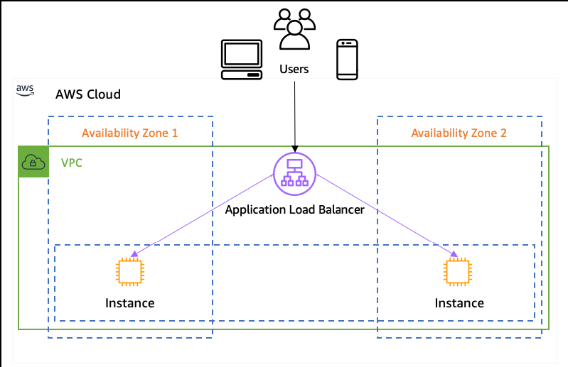
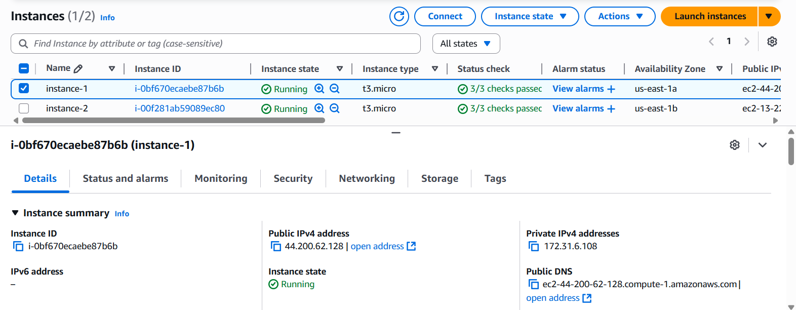
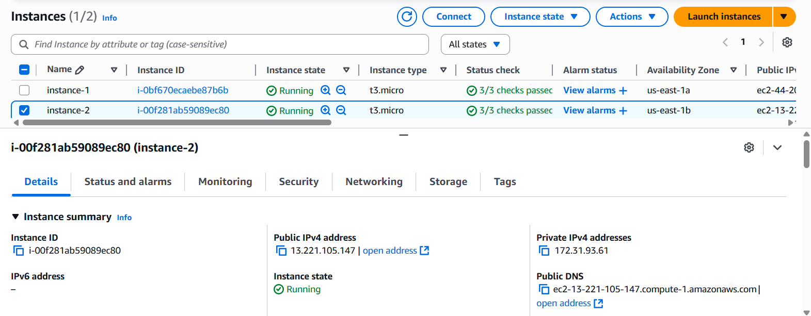
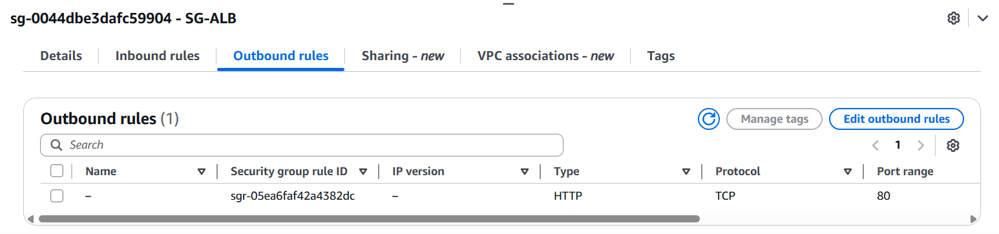
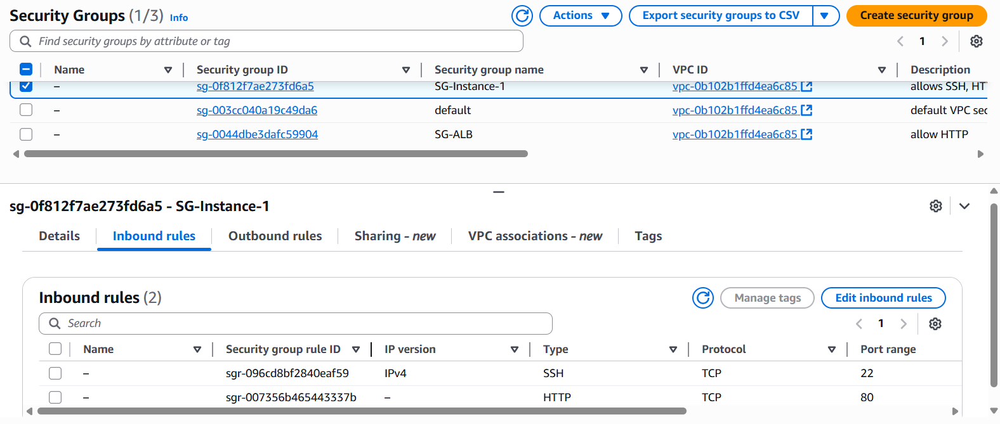
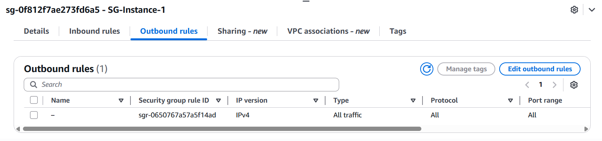
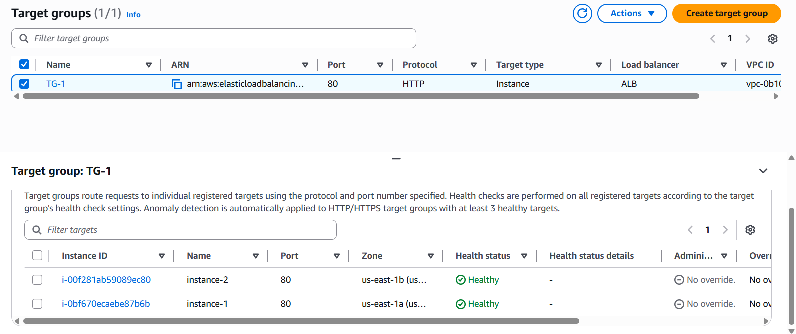
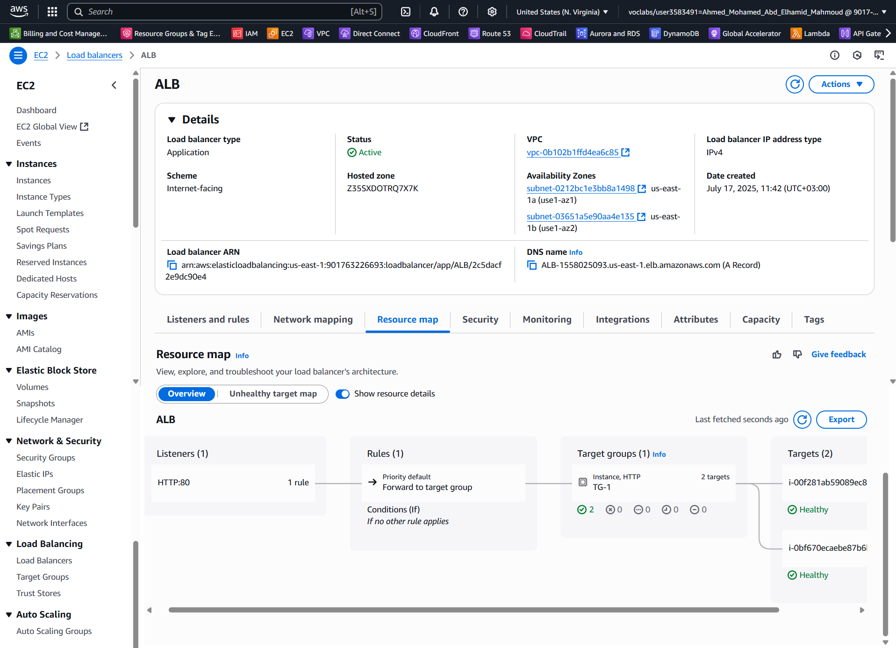

# 🚀 ALB (Application Load Balancer)

Welcome to the documentation for the **Application Load Balancer (ALB)** architecture! This guide covers the overall structure, security, and deployment details of a robust ALB setup in the cloud. 

---

## 🏗️ Architecture Overview



---

## 🖥️ Instances

### Instance 1


### Instance 2


---

## 🔐 Security Groups

### SG-ALB Inbound


### SG-ALB Outbound
```bash
# 🚦 Route "HTTP" traffic only to the security group of the instances for enhanced security
```


---

### SG-Instances Inbound
```bash
# 🔒 Allow SSH & receive traffic only from the security group of ALB for improved protection
```


### SG-Instances Outbound


---

## 🎯 Target Group



---

## 🌐 Application Load Balancer (ALB)



---

## 🚚 Deployment Process
```bash
# 🌀 The ALB uses round-robin routing: initially you'll see "instance-1", and upon refreshing, it will display "instance-2".
```


---

## 📚 Summary

This architecture ensures secure and highly available application delivery using AWS ALB, EC2 instances, and tightly managed security groups. For any questions or further details, feel free to reach out! 😊