# 🏗️ VPC Architecture Documentation

Welcome! This repository provides a comprehensive overview of a typical AWS VPC network architecture, complete with visual diagrams and step-by-step connection instructions. Each section is illustrated for clarity and ease of understanding. 🚀

---

## 🏗️ Architecture

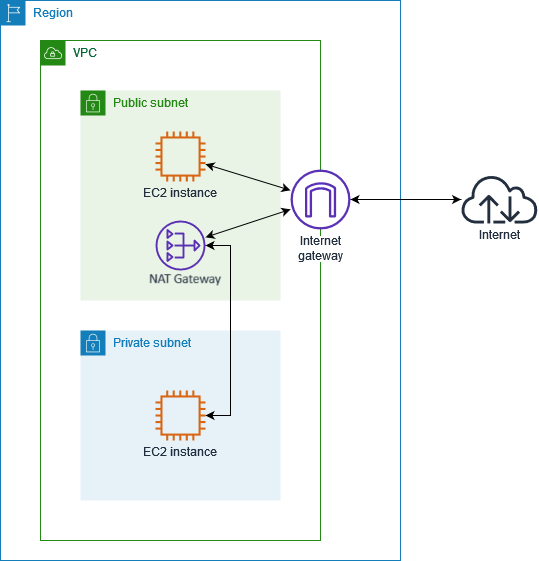

---
---

## 🌐 VPC

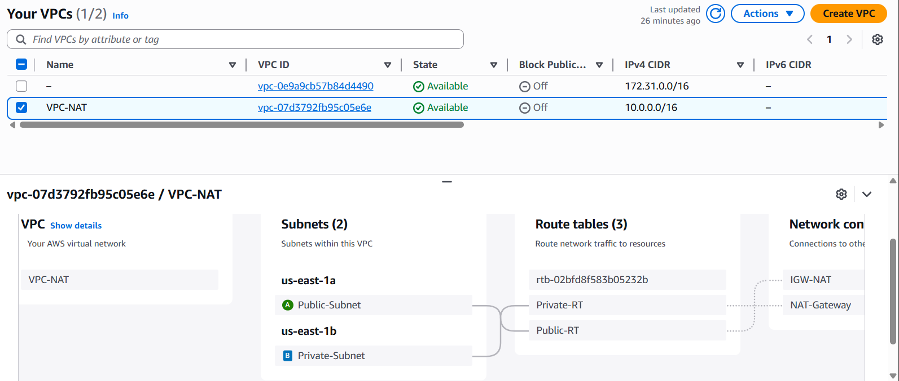

---

## 🌉 Internet Gateway (IGW)

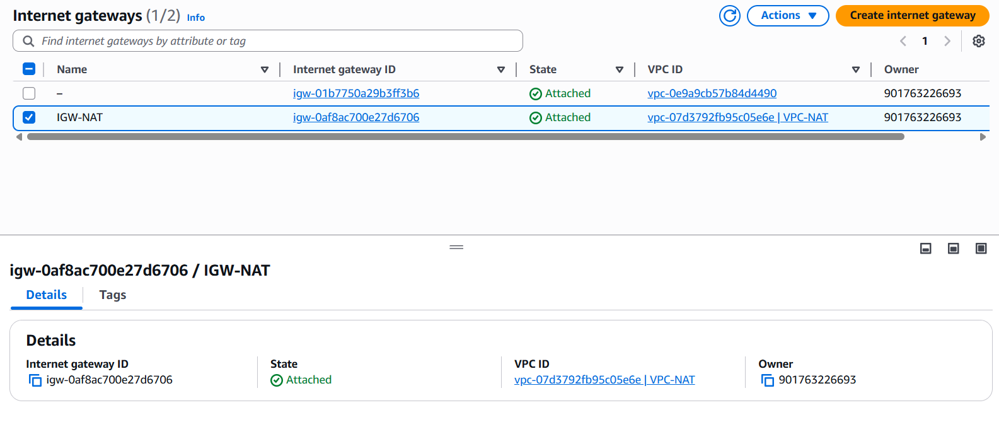

---

## 🟩 Public Subnet

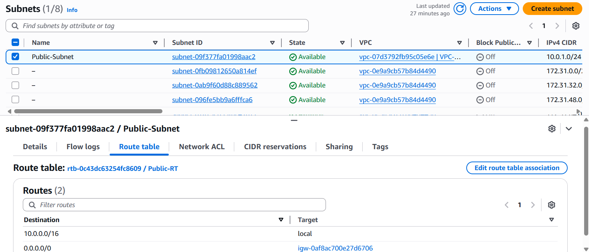

---

## 🟦 Private Subnet

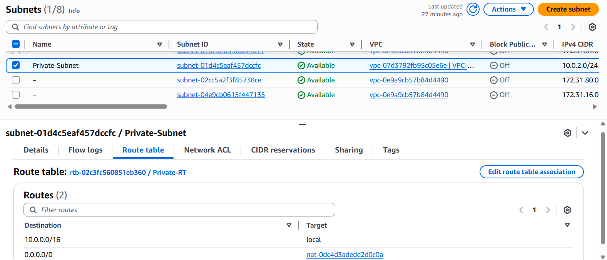

---

## 🛣️ Route Tables

### 🟩 Route Table for Public Subnet


### 🟩 Subnet Associations for Public Route Table
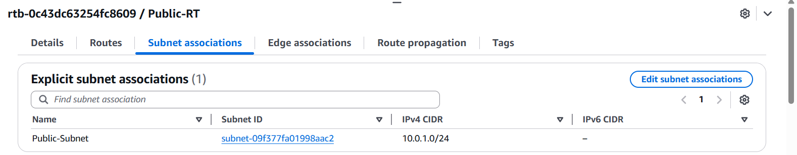

### 🟦 Route Table for Private Subnet
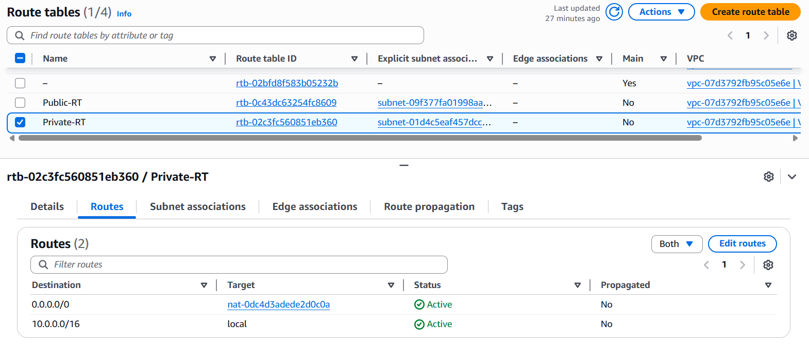

### 🟦 Subnet Associations for Private Route Table
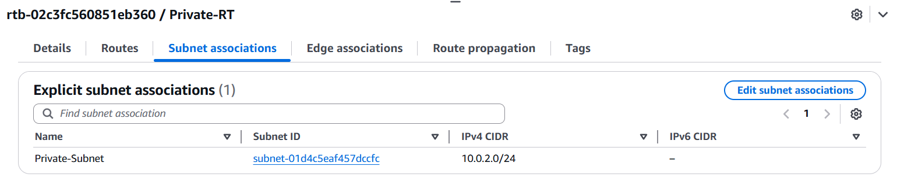

---

## 🌐 Elastic IP (EIP)

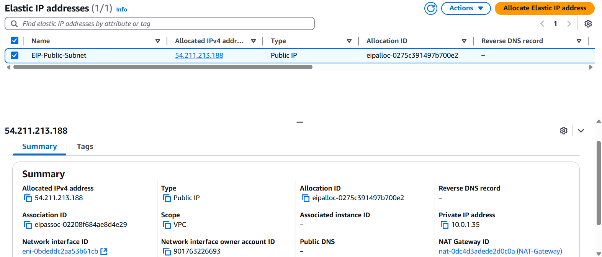

---

## 🔄 NAT Gateway

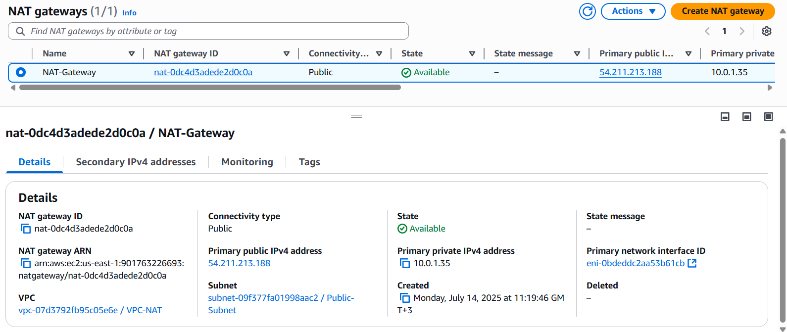

### ℹ️ About NAT Gateway

The **NAT Gateway** (Network Address Translation Gateway) is an AWS-managed service that enables instances in a private subnet to connect to the internet or other AWS services, but prevents the internet from initiating connections with those instances.  

**Key Points:**
- 🌍 **Outbound Only**: Allows outbound-only internet access for resources in private subnets.
- 🔒 **Security**: Ensures private instances remain inaccessible from the public internet.
- ⚡ **High Availability**: Managed by AWS for reliability and scalability.
- 💲 **Elastic IP**: Associates with an Elastic IP address for internet connectivity.
- 🔄 **Automatic Scaling**: Scales automatically to accommodate your bandwidth requirements.

**Typical Use Case:**  
When you want your private EC2 instances to download updates or communicate externally (e.g., with AWS APIs or repositories) without being directly exposed to the internet, a NAT Gateway is the recommended solution.

---

# 🖥️ Public Instance

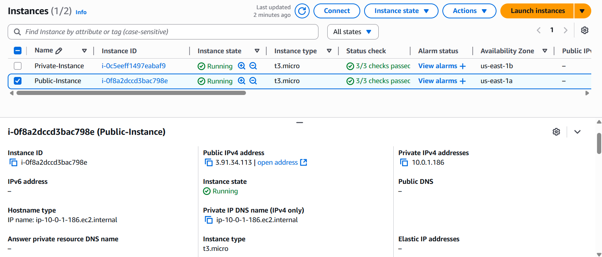

## 🔒 Security Group for Inbound (Public Instance)
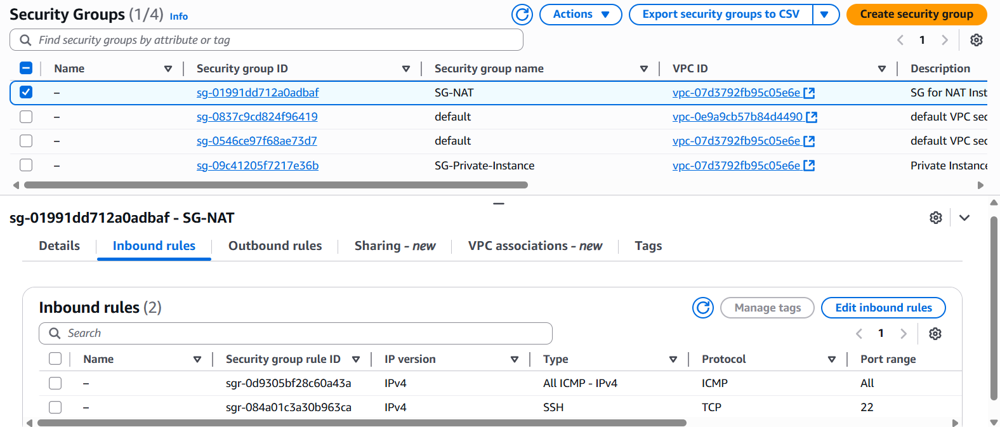

## 🔓 Security Group for Outbound (Public Instance)
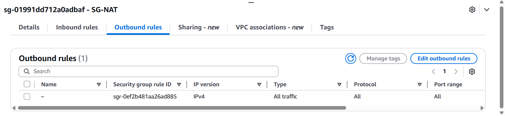

---

# 🖥️ Private Instance

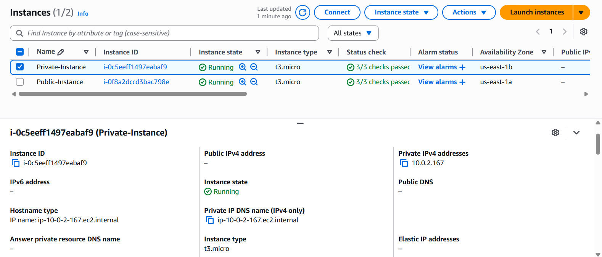

## 🔒 Security Group for Inbound (Private Instance)
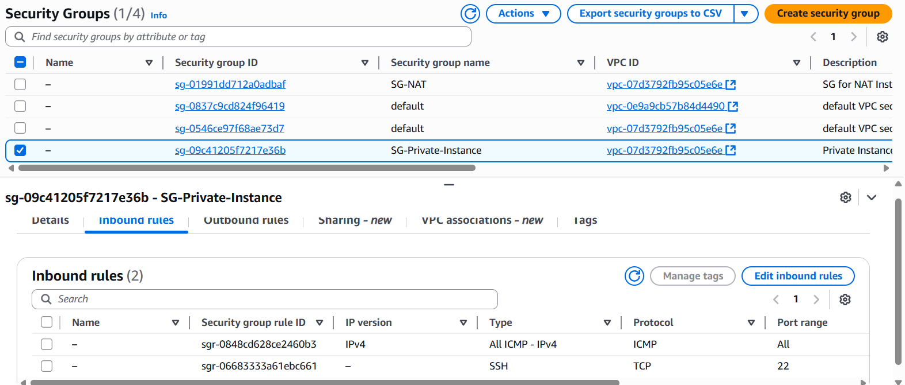

## 🔓 Security Group for Outbound (Private Instance)


---

## 🛠️ SSH Connection Workflow

Follow these steps to connect securely from your local machine to the Public Instance, then SSH into the Private Instance via the Public Instance (acting as a bastion host):

```bash
# 1️⃣ Download your "Private Key" (NAT.pem) to your PC.
# 2️⃣ Set permissions to read-only:
chmod 400 NAT.pem

# 3️⃣ Connect to the Public Instance:
ssh -i NAT.pem ec2-user@<Public-IP>

# 4️⃣ From the Public Instance, connect to the Private Instance:
ssh -i NAT.pem ec2-user@<Private-IP>
```

> **Note:** Always ensure your private key permissions are secure before connecting!

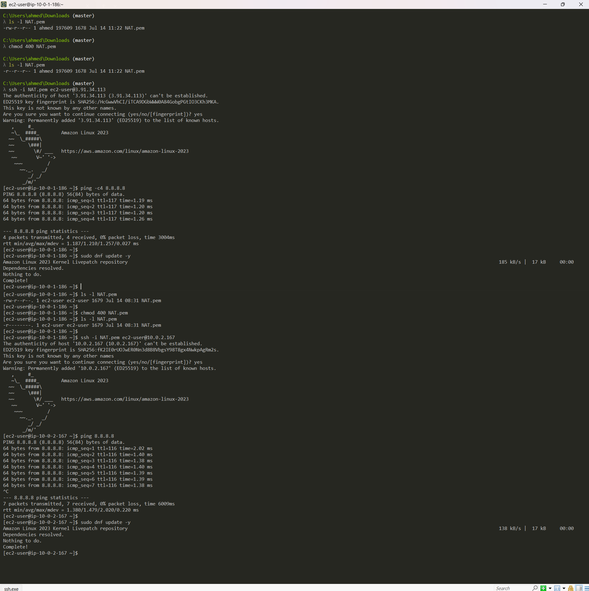

---

## 📄 License

Distributed under the MIT License. See `LICENSE` for more information.

---

## 🙏 Acknowledgments

- AWS Documentation
- Community Contributors

---

Feel free to open issues or contribute improvements! 💡