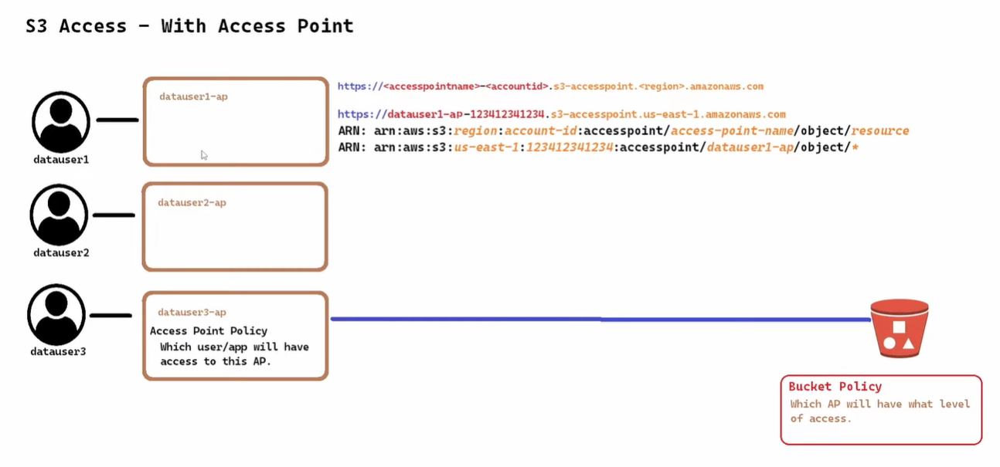
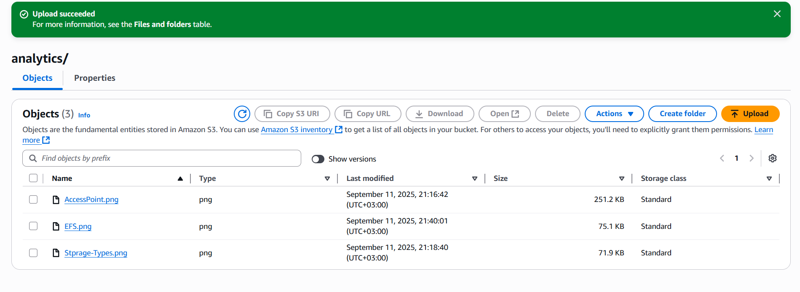
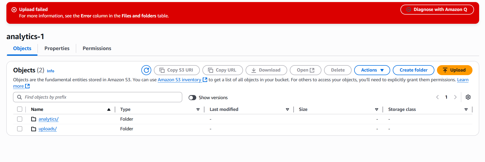

# 🚀 AWS S3 Access Point Setup Guide

Welcome! This professional guide will walk you through setting up an **Amazon S3 Access Point** with proper user permissions, bucket policies, and basic testing steps.  
Whether you're just starting with AWS or need a quick reference, follow along! 😃

---

## 🏗️ 1. Create Access Point
Create **Access Point** for everyone


Access Points make it easier to manage access to shared data sets in S3. Each access point has its own policy and can be restricted to specific users or VPCs.

---

## 👤 2. Create User & Grant Permissions

Create an IAM user and attach the following policy to grant necessary S3 permissions:

```json
{
    "Version": "2012-10-17",
    "Statement": [
        {
            "Sid": "VisualEditor0",
            "Effect": "Allow",
            "Action": [
                "s3:GetAccessPoint",
                "s3:ListAllMyBuckets",
                "s3:ListAccessPoints",
                "s3:ListBucket",
                "s3:ListMultiRegionAccessPoints"
            ],
            "Resource": "*"
        }
    ]
}
```

> 💡 **Tip:** Adjust the actions as needed for your use case.

---

## 🪣 3. Create Bucket

- **Bucket Name:** `access-pointnti`  
- **Folders to Create:**  
  - `analytics`
  - `uploads`

---

### 🛡️ 4. Add Bucket Policy

Apply the following bucket policy to restrict access based on the account:

```json
{
    "Version": "2012-10-17",
    "Statement": [
        {
            "Effect": "Allow",
            "Principal": {
                "AWS": "*"
            },
            "Action": "*",
            "Resource": [
                "arn:aws:s3:::access-pointnti",
                "arn:aws:s3:::access-pointnti/*"
            ],
            "Condition": {
                "StringEquals": {
                    "s3:DataAccessPointAccount": "161242380069"
                }
            }
        }
    ]
}
```

---

## 🌐 5. Create Access Point

> 🏷️ **Note:** Add a tag to your access point to prevent errors during creation.  
📌 Access Point Name: **analytics-1**  
📌 Network origin: **Internet**  

Access Point Policy Example (granting user `testing` access to objects in `analytics`):  

```json
{
    "Version": "2012-10-17",
    "Statement": [
        {
            "Effect": "Allow",
            "Principal": {
                "AWS": "arn:aws:iam::161242380069:user/testing"
            },
            "Action": [
                "s3:GetObject",
                "s3:PutObject"
            ],
            "Resource": "arn:aws:s3:us-east-1:161242380069:accesspoint/analytics-1/object/analytics/*"
        }
    ]
}

// arn:aws:s3:us-east-1:<Account-ID>:accesspoint/<accesspoint-name>/object/<Folder-Name-in-Bucket>/*

```

---

## 🧪 6. Testing

1. **Login** using the IAM User you created.
2. Navigate to **Bucket Name** ➡️ **Access Points** ➡️ **Access Point Name**.
3. You should see the two folders (`analytics`, `uploads`).  
   Click on one and try to **upload** a file!



> 🟢 **Success:** Uploading inside the folder works!

> 🔴 **Error:** Uploading **outside** the allowed folder will result in an error.



---

## ℹ️ Additional Info & Recommendations

- **Access Points** simplify managing access for shared datasets and large teams.
- Always follow least privilege principle for user permissions.
- Use tags for better resource organization and management.
- For production, restrict access further with VPCs and specific IAM roles.
