# 🚀 Create a Static Website on Amazon S3

Welcome to your AWS S3 Static Website lab! In this guide, you'll learn how to:

- 🌐 Host a static website using Amazon S3
- 🔒 Protect your data on Amazon S3
- ♻️ Implement a data lifecycle strategy in Amazon S3
- 💾 Set up a disaster recovery (DR) strategy with Amazon S3

---

## 🗺️ Architecture Overview

At the end of this lab, your architecture will look like this:

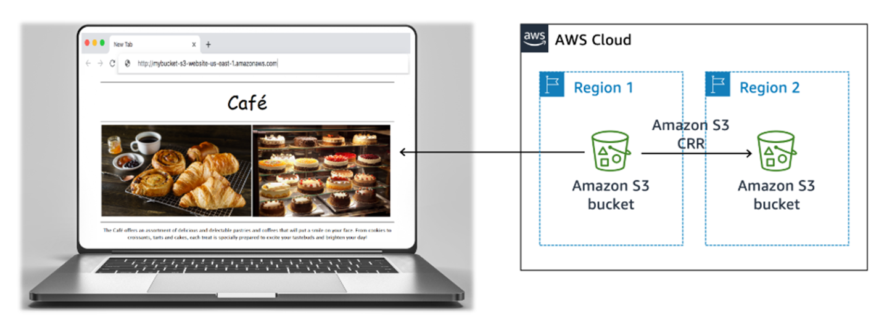

> 📥 **Download & Extract** the web page from [here](https://drive.google.com/file/d/1DMn4u08Ww9b90OG5qvlM_XSZMzGWhPx8/view?usp=sharing)

---

## 1️⃣ Creating an S3 Bucket for Your Static Website

When creating your **S3 Bucket**:

- 🏷️ Bucket Name: `host-static-website-nti`
- 👤 Object Ownership: ACLs Enabled
- 🚫 **Clear** Block all public access

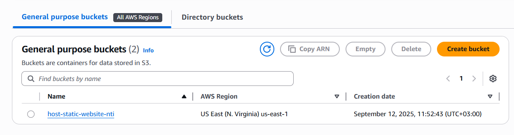

---

## 2️⃣ Uploading Content to Your S3 Bucket

Upload the **index.html** file along with the **CSS** and **images** folders to your S3 bucket.

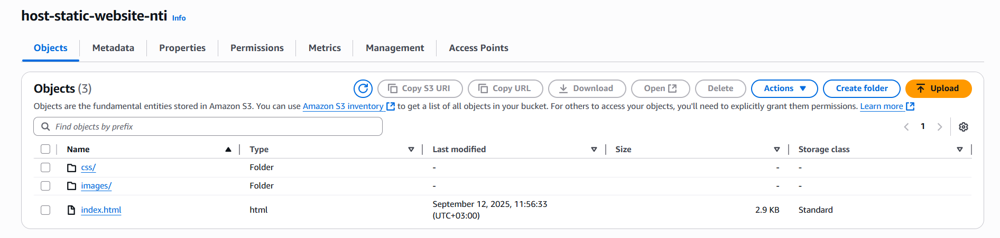

---

## 3️⃣ Enable Static Website Hosting

- Toggle **static website hosting** in the bucket's Properties
- Set **index.html** as the Index document
- 💾 Save changes

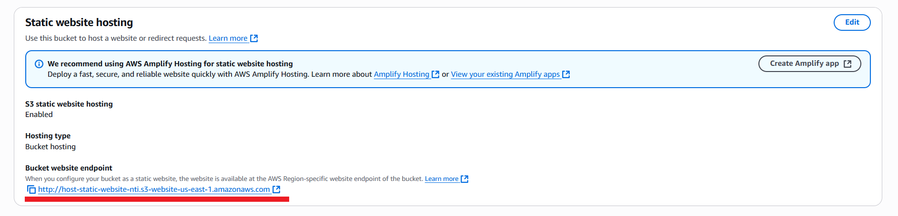

---

### 🖥️ View Your Website

Copy the **Bucket website endpoint URL** and paste it in your browser.

⚠️ **Note:** You won't see your page yet—the files aren't publicly accessible!

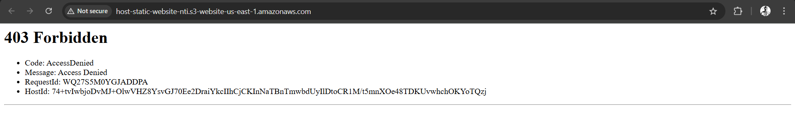

---

## 4️⃣ Grant Public Read Access with a Bucket Policy

If you get stuck, check the [AWS Documentation](https://docs.aws.amazon.com/AmazonS3/latest/userguide/HostingWebsiteOnS3Setup.html#step4-add-bucket-policy-make-content-public).

Add this permission to your bucket policy to make the content public:

```json
{
    "Version": "2012-10-17",
    "Statement": [
        {
            "Sid": "PublicReadGetObject",
            "Effect": "Allow",
            "Principal": "*",
            "Action": "s3:GetObject",
            "Resource": [
                "arn:aws:s3:::host-static-website-nti",
                "arn:aws:s3:::host-static-website-nti/*"
            ]
        }
    ]
}
```
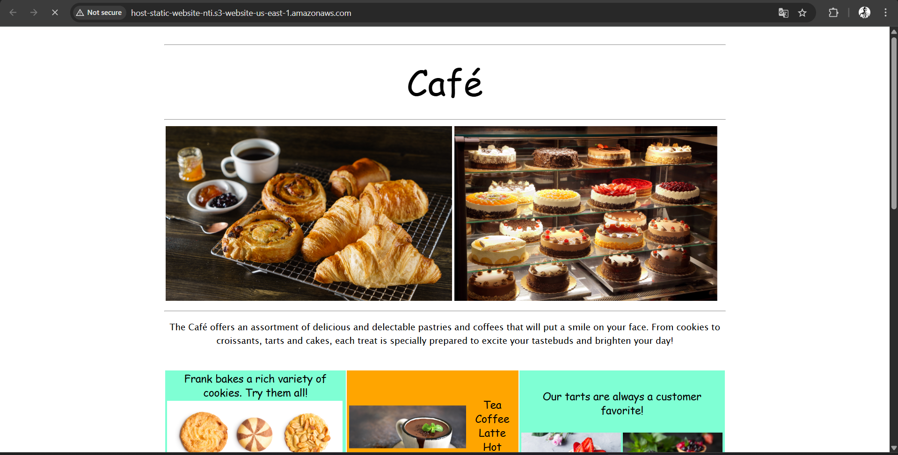

---

## 5️⃣ Protect Website Data

🛡️ Prevent accidental overwrite and deletion of website objects.

### Enable Versioning

- Go to **Properties** → Bucket Versioning → Enable → Save
- ⚠️ **Note:** Once enabled, versioning can't be disabled!

---

### 🔄 Update the HTML File

- Change `bgcolor="aquamarine"` → `bgcolor="gainsboro"`
- Change `bgcolor="orange"` → `bgcolor="cornsilk"`
- Upload the modified HTML file.

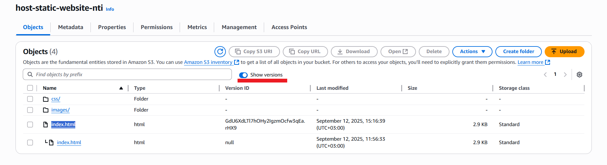

Reload your website and notice the changes!

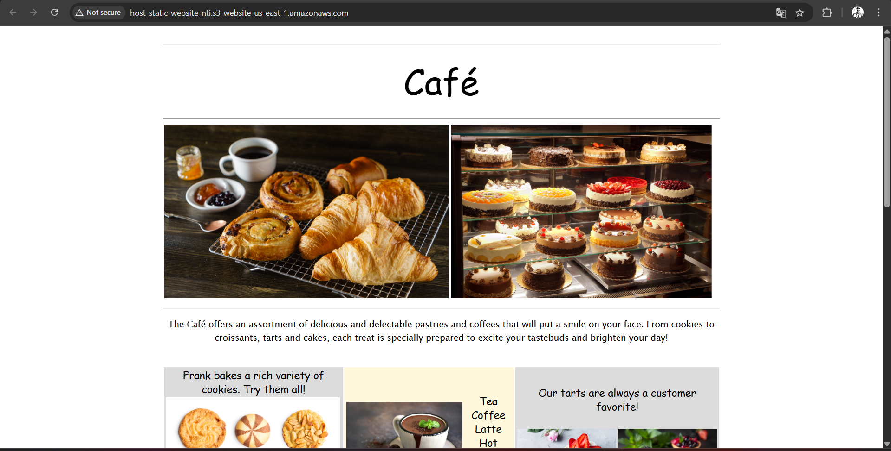

---

## 6️⃣ Optimize Amazon S3 Costs

To manage costs, set a lifecycle policy to retire older object versions.

### Configure Lifecycle Policies

- Move older versions to S3 Standard-Infrequent Access (**S3 Standard-IA**)
- **Management** → Create **Lifecycle rules**

#### Rule 1: Move Old Versions to S3 Standard-IA after 30 Days

- Rule Name: `MovePreviousVersionsToIA`
- Scope: All objects
- Action: Transition noncurrent versions of objects

#### Rule 2: Delete Previous Versions after 365 Days

- Rule Name: `DeletePreviousVersions`
- Scope: All objects
- Action: Permanently delete noncurrent versions
- Days after noncurrent: `365`

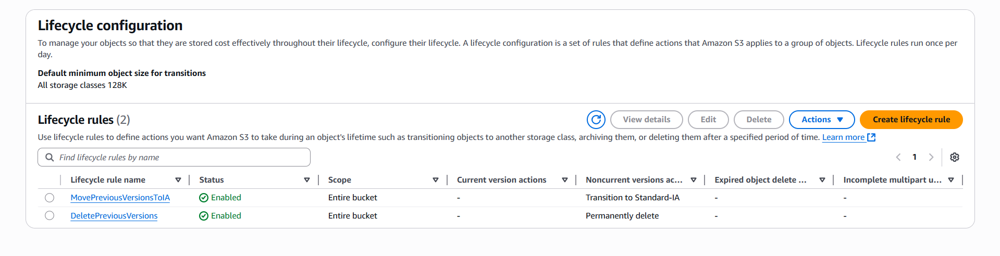

---

## 7️⃣ Enhance Durability & Plan for Disaster Recovery (DR)

Use **cross-Region replication** to back up and archive critical data.

### Enable Cross-Region Replication (CRR)

#### Create Second S3 Bucket (Different Region)

- 🌎 Region: Ohio
- 🏷️ Bucket Name: `host-static-website-nti-2`
- 👤 Object Ownership: ACLs disabled (recommended)
- 🚫 Block all public access
- ✅ Enable Bucket Versioning

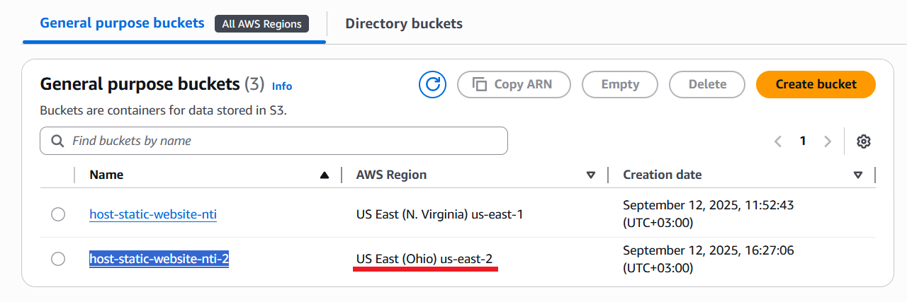

---

#### Set Up Replication Rule in Source Bucket

- Management → Create replication rule
- Rule Name: `ReplicateAllObjects`
- Status: Enabled
- Scope: All objects
- Destination: Choose `host-static-website-nti-2` bucket
- IAM Role Policy:

```json
{
    "Version": "2012-10-17",
    "Statement": [
        {
            "Action": [
                "s3:ListBucket",
                "s3:ReplicateObject",
                "s3:ReplicateDelete",
                "s3:ReplicateTags",
                "s3:Get*"
            ],
            "Resource": [
                "*"
            ],
            "Effect": "Allow"
        }
    ]
}
```
- Save
- Replicate existing objects? **No, do not replicate existing objects**.

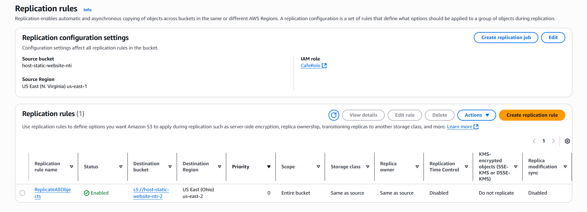

---

## 8️⃣ Update HTML File & Test Replication

- Upload updated HTML file to **Source-Bucket**
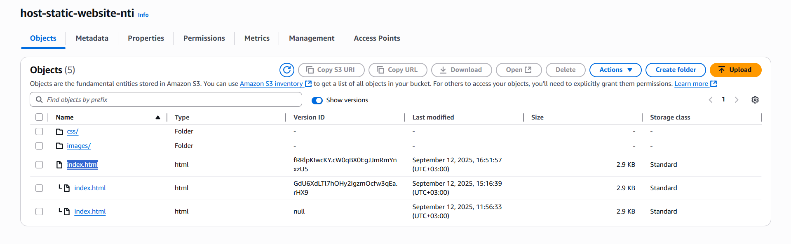

- See replication in **Second Bucket**
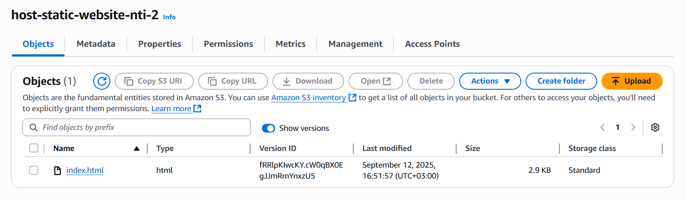

---

## 🎉 Final Output

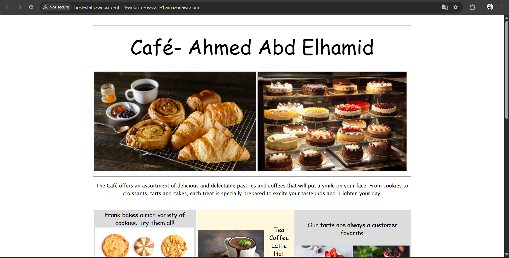

---

## 📝 Check Your Knowledge

💡 Click [here](https://drive.google.com/file/d/1gVo6B73KqHhq4dPA6sSzevrCv_boYswP/view?usp=sharing) to test your understanding!

