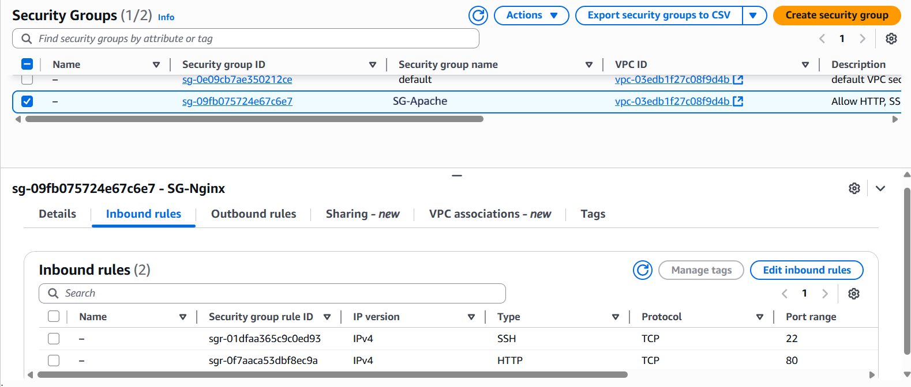
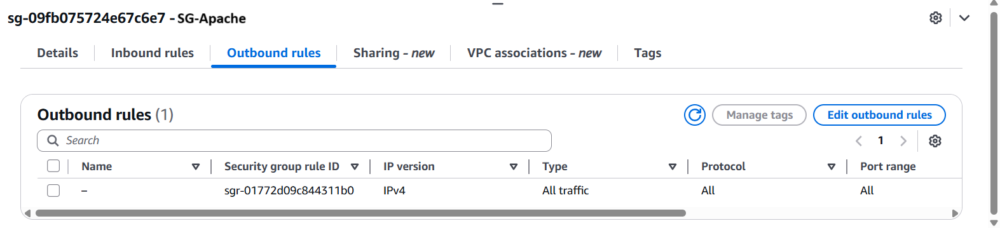
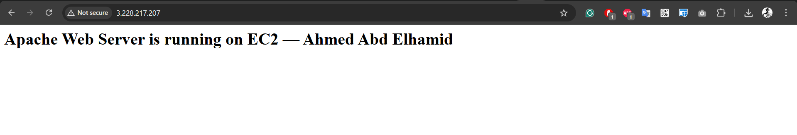
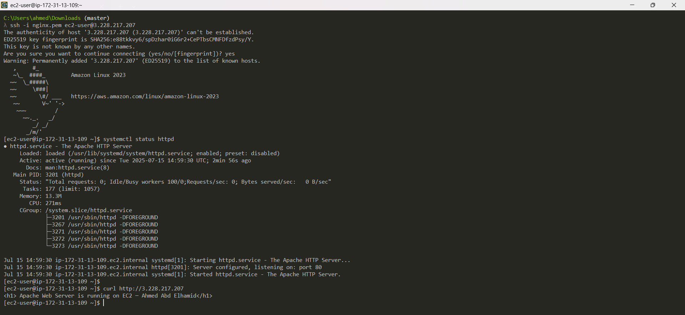

# 🚀 Deploying a Simple Apache Web Server on EC2

This guide demonstrates how to quickly set up an Apache web server on an AWS EC2 instance. You’ll find everything you need—from architecture visuals to essential scripts and troubleshooting tips—to get your application online efficiently and securely.

---

## 🏗️ System Architecture


---

## 🖥️ Apache Hosting Overview


---

## 🔧 EC2 Launch Script

When creating your EC2 instance, use the following script in the **User Data** section to automatically install and start the Apache service:

```bash
#!/bin/bash
dnf update -y
dnf install -y httpd
systemctl enable --now httpd

echo "<h1> Apache Web Server is running on EC2 — Ahmed Abd Elhamid</h1>" > /var/www/html/index.html
```

---

## 🔒 Security Group Settings

### ⬇️ Allowed Inbound Traffic



### ⬆️ Permitted Outbound Traffic



---

## 📦 What You Should See



---

## 🧪 Verifying Deployment



---

## 💡 Helpful Notes & Troubleshooting

```bash
# to connect on EC2-Instance
chmod 400 privatekey.pem
ssh -i privatekey.pem ec2-user@IP


# 🛡️ Always review your Security Group inbound and outbound rules if you run into access issues.

# 📝 If the User Data script fails:
ssh -i privatekey.pem ec2-user@IP
sudo rm -rf /var/lib/cloud/instances/<instance-id>/sem/

# 🔄 To re-run the User Data script:
# 1. Stop your EC2 instance.
# 2. Update the User Data section.
# 3. Restart the instance.

# ⚠️ Remember: User Data scripts only execute during the initial EC2 launch!
```

---

Wishing you a smooth deployment! 🌟