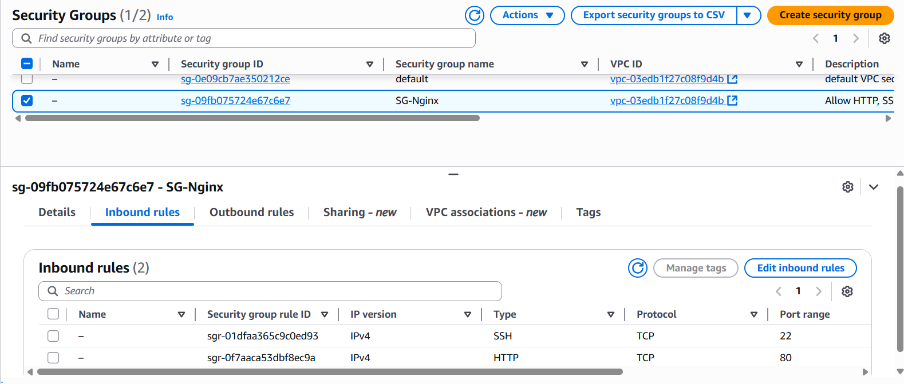
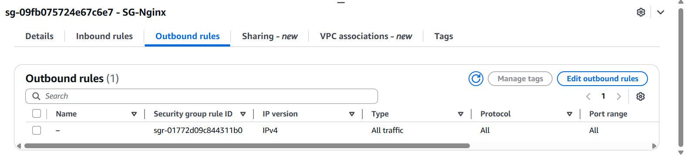
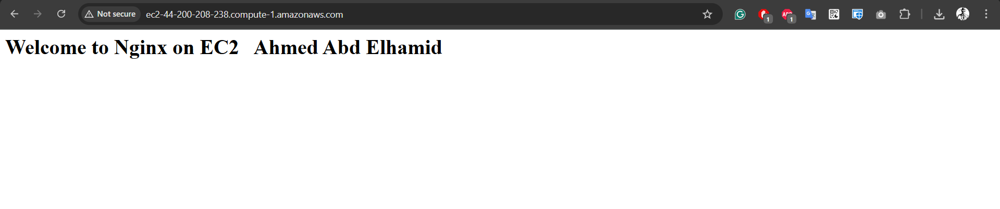
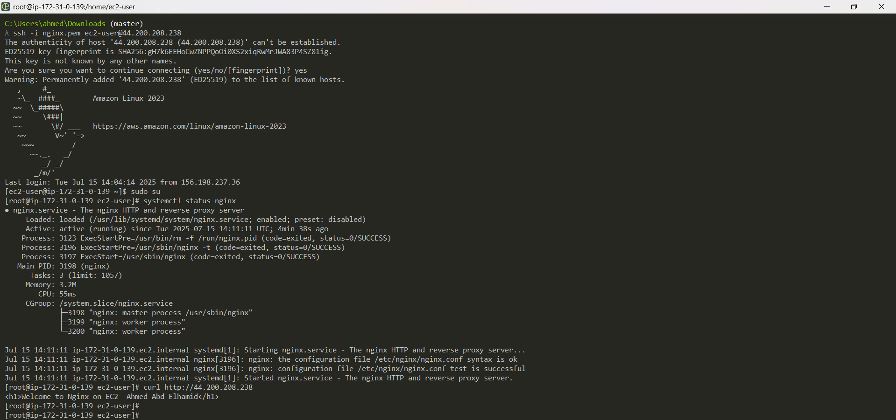

# 🚀 Run Simple App Using Nginx

Welcome! This guide will help you deploy a simple app using **Nginx** on an EC2 instance. Follow the instructions and visuals below to get started quickly and securely!

---

## 🏗️ Architecture


---
---

## 🖥️ Nginx Server Architecture


---

## 🔧 EC2 User Data Script

Use the following script as your **User Data** when launching the EC2 instance to automatically install and configure Nginx:

```bash
#!/bin/bash
dnf update -y
dnf install -y nginx
systemctl enable --now nginx
echo "<h1>Welcome to Nginx on EC2  Ahmed Abd Elhamid</h1>" > /usr/share/nginx/html/index.html
```

---

## 🔒 Security Group Configuration

### 🔽 SG Inbound Rules



### 🔼 SG Outbound Rules



---

## 📦 Output



---

## 🧪 Test Through Terminal



---

## 💡 Tips & Troubleshooting

```bash
# 🛡️ If you face any issues, double-check "Security Inbound & Outbound" rules.

# 📝 If there's an error in the "User Data" script:
ssh -i privatekey.pem ec2-user@IP
sudo rm -rf /var/lib/cloud/instances/<instance-id>/sem/

# 🔄 To update the "User Data" script:
# 1. Stop the EC2 instance.
# 2. Modify the User Data script.
# 3. Start the instance again.

# ⚠️ Note: User Data executes only once during EC2 instance launch!
```

---

Happy Deploying! 🚦