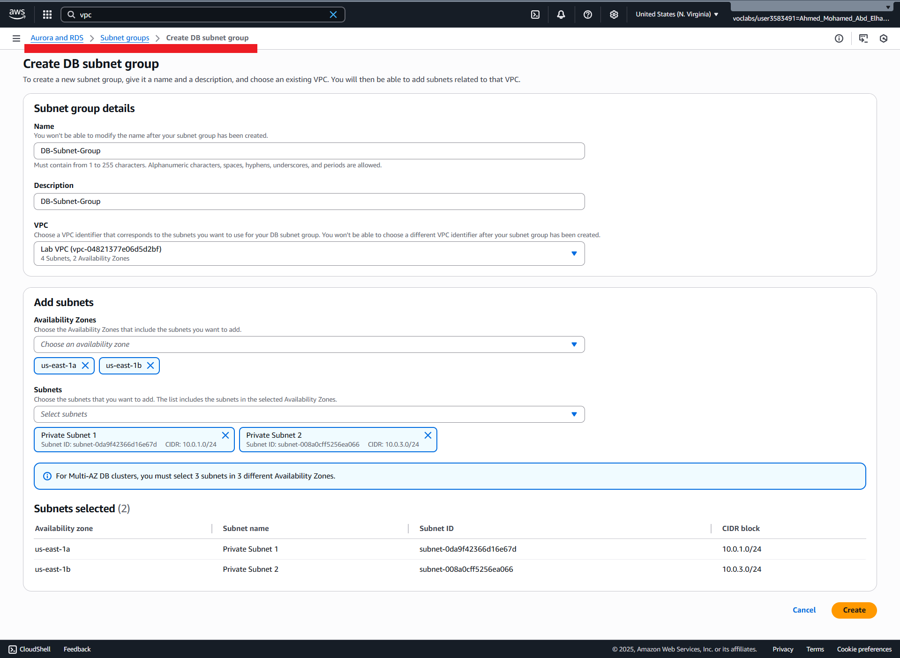
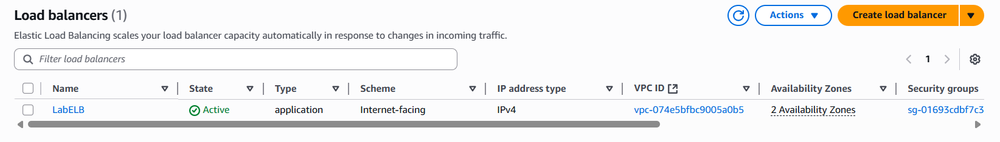

# 🚀 AWS Lab Project Contents


## 1️⃣ Create VPC, Subnet & NAT Gateway
Welcome to the AWS networking lab! By the end of this guide, you'll be able to:

- 🏗️ **Create a VPC**
- 🌐 **Create Public & Private Subnets**
- 🔒 **Configure a Security Group**
- 🖥️ **Launch an EC2 Instance into a VPC**

---

### 📚 Architecture Overview


---

### 1️) Create VPC


**Architecture after creating VPC:**


---

### 2️) Create Additional Subnets

- 🟢 **Public Subnet**

  

- 🔵 **Private Subnet**

  

---

### 3️) Configure Route Tables

- 🌍 **Route Table for Public Subnet**

  
  

- 🔐 **Route Table for Private Subnet**

  
  

**Architecture after creating Subnets & Route Tables:**


---

### 4️) Create a VPC Security Group


---

### 5️) Launch EC2 Instance
- 📝 **Instance Name:** `Web Server 1`
- 🖥️ **Instance Type:** `t2.micro`
- 🗺️ **Network settings:**
  - **Network:** `lab-vpc`
  - **Subnet:** `lab-subnet-public2` _(not Private!)_
  - **Auto-assign Public IP:** ✅ Enable
  - **Security Group:** Select existing, choose **Web Security Group**

- 💻 **User Data Script:**

  ```bash
  #!/bin/bash
  # Install Apache Web Server and PHP
  dnf install -y httpd wget php mariadb105-server
  # Download Lab files
  wget https://aws-tc-largeobjects.s3.us-west-2.amazonaws.com/CUR-TF-100-ACCLFO-2/2-lab2-vpc/s3/lab-app.zip
  unzip lab-app.zip -d /var/www/html/
  # Enable web server
  chkconfig httpd on
  service httpd start
  # Enable and start Apache web server
  # sudo systemctl enable --now httpd
  ```


---
### 🏁 Final Architecture


---

### 🎉 Output


---

> 💡 **You did it!** You've built a VPC with public/private subnets, route tables, a security group, and a running EC2 web server. 🎊

---

<br>
<br>
<br>

## 2️⃣ Create Database (Amazon RDS)

You start with the following infrastructure:


By the end of this lab, you will be able to:
- 🚀 Launch an Amazon RDS DB instance with high availability.
- 🔗 Configure the DB instance to permit connections from your web server.
- 🌐 Open a web application and interact with your database.

By the end of the lab, you will have this infrastructure:
 - 

---

### 1️) Create a Security Group for the "RDS DB Instance"
You will add a rule to permit access from the **Web Security Group**.


---

### 2️) Create a **DB Subnet Group** from **RDS**



---

### 3️) Create an **Amazon RDS DB Instance**
- ⚙️ **Create Database**
  - **Database creation method:** Standard create
  - **Engine type:** MYSQL
  - **Templates:** Dev/Test
  - **Availability and durability:** Multi-AZ DB instance
  - **Settings:**
    - DB instance identifier: `lab-db`
    - Master username: `main`
    - Master password: `lab-password`
    - Confirm password: `lab-password` 
  - **DB instance class:** Burstable classes (includes t classes):  `db.t3.micro` 
  - **Storage:**
    - Storage type: General Purpose (SSD)
    - Allocated storage: 20 GB
  - **Connectivity:**
    - Virtual Private Cloud (VPC): Lab VPC
  - **Existing VPC security groups:**
    - Choose DB Security Group
    - Deselect default
  - **Monitoring:**
    - Uncheck **Enable Enhanced monitoring**
  - **Additional configuration:**
    - Initial database name: `lab`
    - Uncheck **Enable automatic backups**
    - Uncheck **Enable encryption**

> ⏳ You will now need to **wait approximately 15 minutes** for the database to be available.


---

### 4️) Interact with Your Database

1. From **EC2**, copy **Public IP Address** and open it in your **Browser**  
   

2. Choose the **RDS** link at the top of the page

3. Configure the following settings:
    - Endpoint: **Paste the Endpoint of the RDS** you copied to the table
    - Database: `lab`
    - Username: `main`
    - Password: `lab-password`
    - Choose **Submit**

   

4. After a few seconds the application will display: **Address Book**
   

5. You can try to **book** by yourself  
   

---

> 🌟 **Congratulations!** You've successfully launched a secure, highly available database and integrated it with your web server in AWS.

---

<br>
<br>
<br>

## 3️⃣ AMI, Target Group & Load Balancer, Launch Template & Auto Scaling Group, CloudWatch Alarm


You start with the following infrastructure:


By the end of this lab, you will be able to:
- 🖼️ Create an **Amazon Machine Image (AMI)** from a running instance
- 🎯 Create a **Target Group**
- 🌀 Create a **load balancer**
- 📦 Create a **launch template** and an **Auto Scaling group**
- 📈 Automatically **scale new instances** 
- 📊 Create **Amazon CloudWatch alarms** and monitor performance of your infrastructure

<br>
<br>

**The final state of the infrastructure is:**


### 🖼️ Create AMI from Web Server for Auto Scaling
- Select **Web Server 1**
- In the **Actions** menu, choose **Image and templates** --> **Create image**


<br>

My **AMI**


<br>

### 🎯 Create Target Group
To create a **target group**:
- Target type: Instances
- Target group name: LabGroup
- Select **Lab VPC** from the VPC drop-down menu
  

 
### 🌀 Create a Load Balancer
To create a **Load Balancer**:
- Load balancer types: Application Load Balancer --> Choose **Create**
- Load balancer name: LabELB
- Scheme: internet-facing
- Network mapping:
  - VPC: Lab VPC
  - Availability Zones and subnets: 
    - us-east-1a (use1-az2): Public Subnet 1 
    - us-east-1b (use1-az4): Public Subnet 2
- Security groups:
  - Select **Web Security Group**
- Listeners and routing:
  - Listener: Select **Target Group**: LabGroup
- Create **Load Balancer**




### 📦 Create a Launch Template and Auto Scaling Group
To create **launch template**:
- Launch template name: LabConfig
- Under **Auto Scaling guidance**, select **Provide guidance to help me set up a template that I can use with EC2 Auto Scaling**
- Amazon Machine Image (AMI): choose **MY AMI** (Web Server AMI)
- Instance type: t2.micro
- Key pair name: vockey
- Firewall (security groups): choose **Select existing security group** 
- Security groups: **Web Security Group**
- Advanced details:
  - Detailed CloudWatch monitoring: **Enable** 
- Create Launch Template


<br>

To create **Auto Scaling Group**:
- Auto Scaling group name: Lab Auto Scaling Group
- Launch template: Choose **LabConfig** template
- Network:
  - VPC: Lab VPC
  - Availability Zones and subnets: Choose **Private Subnet 1** and **Private Subnet 2**
- Load balancing: **Attach to an existing load balancer** 
  - Existing load balancer target groups: select **LabGroup**
- Group size:
  - Desired capacity: 2
  - Minimum capacity: 2
  - Maximum capacity: 6 
- Automatic scaling: choose **Target tracking scaling policy**:
  - Scaling policy name: LabScalingPolicy
  - Metric type: Average CPU Utilization
  - Target value: 60
- Monitoring:
  - Enable group metrics collection within CloudWatch  
- Tag:
  - Key: Name
  - Value: Lab Instance
- Create Auto Scaling group


### 🔍 Verify that Load Balancing is Working
In **EC2**:  
You should see **two new instances named Lab Instance**


In **Target Group**:  
**Two target instances named Lab Instance** should be listed in the **target group**.


In **Load Balancer**:  
Copy **DNS Name** and paste it in the **Browser**.


### ⚡ Test Auto Scaling
In **CloudWatch**:


From **Auto Scaling Group**:
- Automatic Scaling:
  - Select **LabScalingPolicy**
  - From Action: Choose **Edit**
    - Change **Target value** to 50
    - Update
 
**CloudWatch Alarm**


Increase number of **instances**


## 🛑 Terminate Web Server 1
